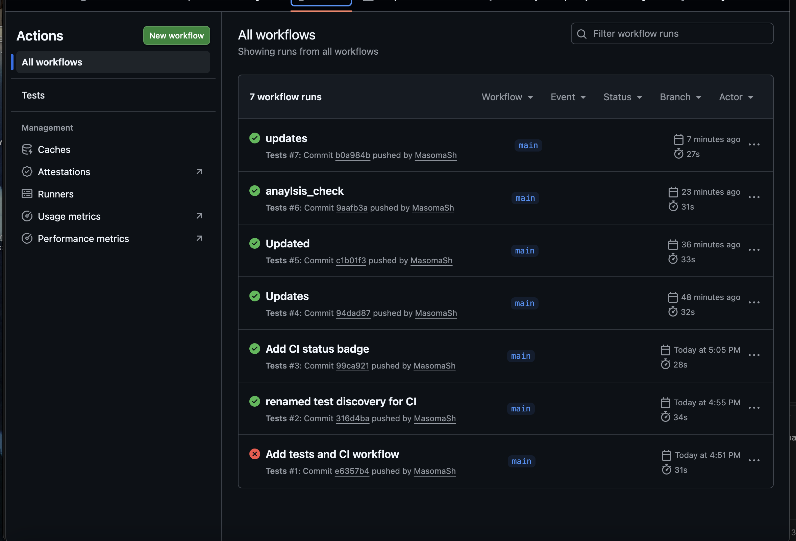
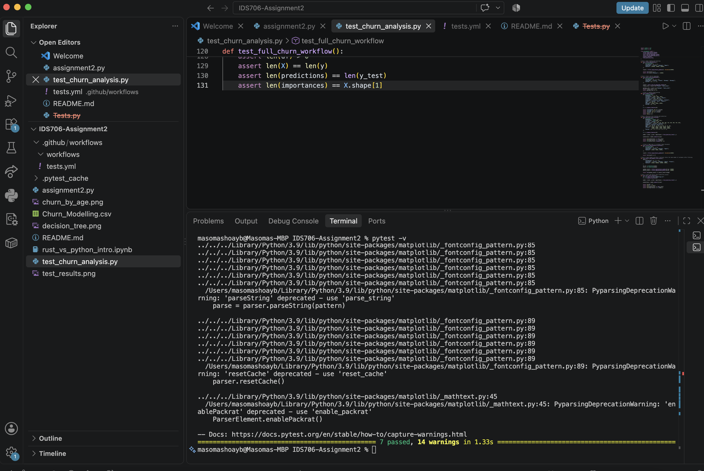

# IDS706 Assignment 2

## Overview

The project analyzes customer churn using the Churn Modelling dataset and compares basic data analysis operations using Pandas and Polars. The project also uses a Decision Tree Classifier to predict whether a customer will churn based on customer characteristics such as age, balance, credit score, geography, gender, activity level, and number of products. 
The project includes data exploration, filtering, grouping and aggregation, feature preprocessing, machine learning, visualization, unit testing, and a GitHub Actions CI workflow.

## Dataset
The dataset used in this project is the **Churn Modelling** dataset, stored in `Churn_Modelling.csv`. The dataset contains information about bank customers and whether they exited the bank. It is obtained from Kaggle. 

The main columns include:
- `CustomerId` - Unique customer identifier
- `Surname` - Customer surname
- `CreditScore` - Customer credit score
- `Geography` - Customer's country
- `Gender` - Customer gender
- `Age` - Customer age
- `Tenure` - Number of years the customer has been with the bank
- `Balance` - Customer account balance
- `NumOfProducts` - Number of products used by the customer
- `HasCrCard` - Whether the customer has a credit card
- `IsActiveMember` - Whether the customer is an active member
- `EstimatedSalary` - Estimated customer salary
- `Exited` - Whether the customer left the bank, where 1 indicates churn and 0 indicates no churn

## Project Tasks
The project includes the following tasks:

- Importing and inspecting the dataset using Pandas and Polars
- Examining the dataset using `.head()`, `.info()`, `.schema`, and `.describe()`
- Checking for missing values and duplicate rows
- Filtering customers based on account balance
- Calculating customer counts and churn rates by geography
- Comparing Pandas and Polars for selected data analysis operations
- Preparing features for machine learning
- Encoding categorical variables using one-hot encoding
- Training a Decision Tree Classifier to predict customer churn
- Evaluating the model using accuracy, a confusion matrix, and a classification report
- Examining feature importance from the Decision Tree
- Creating a bar chart showing churn rate by age group
- Creating a visualization of the trained Decision Tree
- Writing unit tests for core project functions
- Running automated tests using GitHub Actions

## Machine Learning

The target variable is `Exited`.

- `0` = Customer stayed
- `1` = Customer churned

The `prepare_features()` function removes identifier and target columns that should not be used as input features:

- `RowNumber`
- `CustomerId`
- `Surname`
- `Exited`

The categorical variables `Geography` and `Gender` are converted into numerical features using one-hot encoding.
A Decision Tree Classifier is then trained using an 80/20 train-test split with stratification and a fixed random state for reproducibility.
The model is configured with a maximum depth of 4 to keep the tree relatively small and easier to interpret.

## Visualizations

The project creates two visualizations:

### Churn Rate by Age Group

`churn_by_age.png` shows the average churn rate for different age groups.

### Decision Tree

`decision_tree.png` displays the trained Decision Tree Classifier and the features used to make its predictions.

## Testing
The project includes unit and integration tests in: test_churn_analysis.py
The tests cover the main functionality of the project, including:

- Filtering customers with balances above a given threshold
- Calculating churn rates by geography
- Preparing features for machine learning
- Training and testing the Decision Tree Classifier
- Testing an edge case where no customers meet the balance threshold
- Comparing Pandas and Polars filtering results
- Testing the complete customer churn workflow

The test suite contains 7 tests.
Run the tests locally with:
    - python3 -m pytest -v

## Continuous Integration

GitHub Actions is used to automatically run the test suite when changes are pushed to the repository or when a pull request is created.
The GitHub Actions workflow is located at:

.github/workflows/tests.yml

The workflow performs the following steps:

- Checks out the repository
- Sets up Python 3.11
- Installs the required Python packages
- Runs the pytest test suite

## Setup
### Requirements
This project was developed and tested on macOS and requires:

- Python 3.11+
- Pandas
- Polars
- Scikit-learn
- Matplotlib
- Pytest
- Rust (rustc and cargo) for the Rust notebook
- Jupyter
- VS Code with the Python and Jupyter extensions
- A Rust Jupyter kernel for running the Rust notebook
- Git
### Python Setup
From the project directory, install the required libraries:
python3 -m pip install pandas polars scikit-learn matplotlib pytest

### Rust Setup
Rust is required for running and modifying the Rust Jupyter notebook.
- If Rust is not already installed, install it using rustup:
    - curl --proto '=https' --tlsv1.2 -sSf https://sh.rustup.rs | sh
- Open a new terminal after installation and verify Rust:
    - rustc --version
    - cargo --version
- Both commands should return the installed Rust and Cargo versions.

### Rust Jupyter Kernel
The Rust notebook requires a Rust Jupyter kernel.
- From the project directory, install the Rust kernel using: 
    - make rust-kernel
- Alternatively, if the required Rust Jupyter kernel tools are already installed, the kernel can be installed with:
    - evcxr_jupyter --install

## How to Run
- Clone the repository and move into the project directory:
    git clone https://github.com/MasomaSh/IDS706_Assignment2.git
- cd IDS706_Assignment2
- The repository contains the Python analysis, unit tests, and Rust Jupyter notebook.
- Install the required Python libraries:
    python3 -m pip install pandas polars numpy scikit-learn matplotlib pytest
- Run the Python analysis:
    python3 assignment2.py
- Run the unit tests:
    pytest
- The repository also includes a GitHub Actions workflow that automatically runs the tests when changes are pushed to GitHub.
- Open the Rust Jupyter notebook in VS Code or Jupyter and select the Rust Jupyter kernel.
- Run the notebook cells to reproduce the Rust ownership and mutability experiments.

## Project Files
The main files in the repository are:
- IDS706-Assignment2/
    - assignment2.py
    - test_churn_analysis.py
    - Churn_Modelling.csv
    - README.md
    - churn_by_age.png
    - decision_tree.png
    - .github/
        - workflows/
        - tests.yml

### assignment2.py

Contains the main customer churn analysis. The script includes:

- Pandas data analysis
- Polars data analysis
- Data filtering
- Grouping and aggregation
- Feature preprocessing
- Decision Tree training
- Model evaluation
- Feature importance
- Data visualizations
- Pandas and Polars execution-time comparison

### test_churn_analysis.py
Contains the unit and integration tests for the project.
The tests check the behavior of the main data processing and machine learning functions and also include a full workflow test using the actual dataset.
### rust_vs_python.ipynb
Contains the Rust Jupyter notebook used to experiment with Rust ownership and mutability concepts. 

# Performance Comparison
The execution time of the basic data analysis operations was measured using Python's time.perf_counter().
The timing includes:
- Reading the CSV file
- Inspecting the dataset
- Calculating summary statistics
- Checking missing values and duplicates
- Filtering the data
- Grouping and aggregating the data
Result: In the test run, Pandas was faster than Polars for the selected operations. This result should be interpreted only for this dataset and these operations. Performance can vary depending on dataset size, operations, hardware, and other factors. 

## Test Results

The GitHub Actions workflow successfully runs all unit tests.

