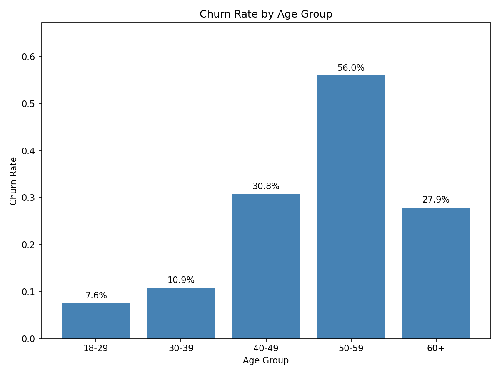
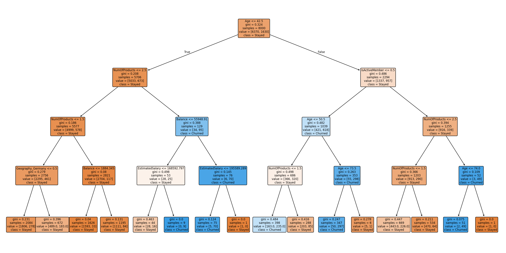
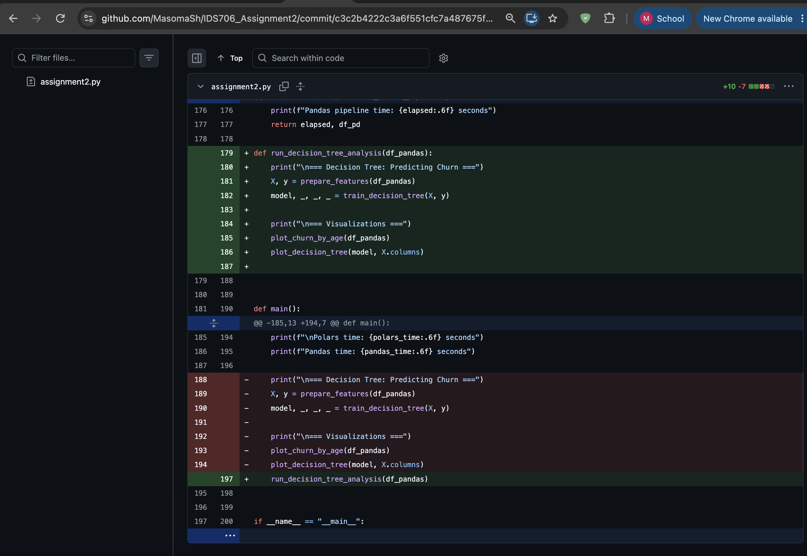
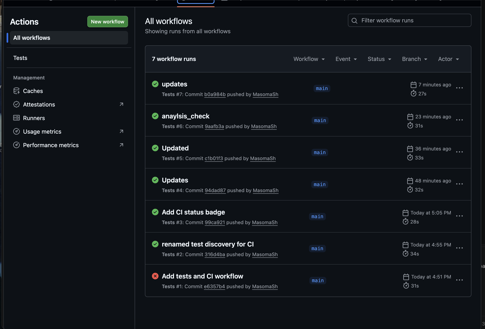
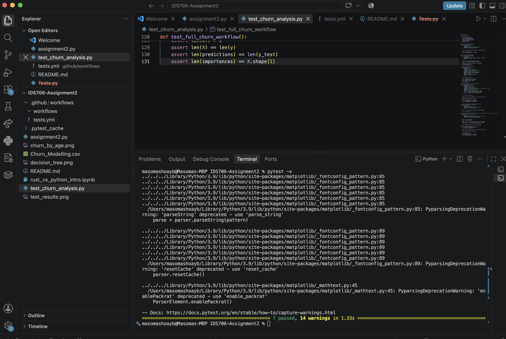

# IDS706 Assignment 2
[](https://github.com/MasomaSh/IDS706_Assignment2/actions/workflows/tests.yml)

## Overview

This project analyzes customer churn using the Churn Modelling dataset and compares selected data analysis operations using Pandas and Polars.

The project also uses a Decision Tree Classifier to predict whether a customer will churn based on characteristics such as age, balance, credit score, geography, gender, activity level, and number of products.

The project includes:

- Data exploration
- Data quality checks
- Filtering, grouping, and aggregation
- Pandas and Polars comparison
- Feature preprocessing
- Machine learning
- Data visualization
- Unit and integration testing
- Code quality checks with Ruff
- GitHub Actions continuous integration
- Docker containerization
- Rust and Python experiments

## Problem Statement

Customer churn is an important problem for banks because losing customers can affect revenue and long-term customer relationships.

The goal of this project is to explore customer characteristics associated with churn and build a simple machine learning model that predicts whether a customer is likely to leave the bank.

The analysis uses the `Exited` variable as the churn indicator and examines customer demographics, account information, and banking activity.

## Dataset

The dataset used in this project is the **Churn Modelling** dataset, stored in `Churn_Modelling.csv`. The dataset contains information about bank customers and whether they exited the bank. The dataset was obtained from Kaggle.

The main columns include:

- `CustomerId` - Unique customer identifier
- `Surname` - Customer surname
- `CreditScore` - Customer credit score
- `Geography` - Customer's country
- `Gender` - Customer gender
- `Age` - Customer age
- `Tenure` - Number of years the customer has been with the bank
- `Balance` - Customer account balance
- `NumOfProducts` - Number of products used by the customer
- `HasCrCard` - Whether the customer has a credit card
- `IsActiveMember` - Whether the customer is an active member
- `EstimatedSalary` - Estimated customer salary
- `Exited` - Whether the customer left the bank, where `1` indicates churn and `0` indicates no churn

## Project Tasks

The project includes the following tasks:

- Importing and inspecting the dataset using Pandas and Polars
- Examining the dataset using `.head()`, `.info()`, `.schema()`, and `.describe()`
- Checking for missing values and duplicate rows
- Filtering customers based on account balance
- Calculating customer counts and churn rates by geography
- Comparing Pandas and Polars for selected data analysis operations
- Preparing features for machine learning
- Encoding categorical variables using one-hot encoding
- Training a Decision Tree Classifier to predict customer churn
- Evaluating the model using accuracy, a confusion matrix, and a classification report
- Examining feature importance from the Decision Tree
- Creating a bar chart showing churn rate by age group
- Creating a visualization of the trained Decision Tree
- Writing unit and integration tests
- Running automated tests using GitHub Actions
- Checking code quality using Ruff
- Containerizing the project with Docker

## Data Quality

The project checks the dataset for:

- Missing values
- Duplicate rows
- Dataset dimensions
- Summary statistics
- Potential unusual values through descriptive statistics

These checks are performed during the Pandas and Polars data inspection steps in `assignment2.py`.

The project also uses filtering and grouped summaries to examine the customer data before model training.

## Machine Learning

The target variable is `Exited`.

- `0` = Customer stayed
- `1` = Customer churned

The `prepare_features()` function removes identifier and target columns that should not be used as model input:

- `RowNumber`
- `CustomerId`
- `Surname`
- `Exited`

The categorical variables `Geography` and `Gender` are converted into numerical features using one-hot encoding.

A Decision Tree Classifier is trained using an 80/20 train-test split with stratification and a fixed random state for reproducibility.

The model uses:

```text
max_depth = 4
random_state = 42
```

The maximum tree depth keeps the model relatively small and easier to interpret.

Model evaluation includes:

- Accuracy
- Confusion matrix
- Classification report
- Feature importance

## Visualizations

### Churn Rate by Age Group

`churn_by_age.png` shows the average churn rate for different age groups.



### Decision Tree

`decision_tree.png` displays the trained Decision Tree Classifier and the features used to make its predictions.



## Testing

The project includes unit and integration tests in `test_churn_analysis.py`.

The test suite contains **10 tests** covering:

- Filtering customers with balances above a given threshold
- Calculating churn rates by geography
- Preparing features for machine learning
- Training and testing the Decision Tree Classifier
- Testing an edge case where no customers meet the balance threshold
- Comparing Pandas and Polars filtering results
- Testing the complete customer churn workflow
- Testing an empty DataFrame
- Testing a single customer
- Testing the threshold boundary condition

The tests include both typical cases and meaningful edge cases.

Run the tests locally with:

```bash
python3 -m pytest -v
```

## Continuous Integration

GitHub Actions automatically checks the project when changes are pushed to the repository or when a pull request is created.

The workflow is located at:

```text
.github/workflows/tests.yml
```

The workflow:

1. Checks out the repository
2. Sets up Python 3.11
3. Installs the required Python packages
4. Checks Python syntax using `py_compile`
5. Runs Ruff linting
6. Runs the full pytest test suite

The CI workflow helps verify that the project continues to pass its tests and code quality checks after changes.

## Code Quality and Refactoring

The project was refactored by extracting the Decision Tree analysis and visualization steps from `main()` into a separate `run_decision_tree_analysis()` function.

This makes `main()` shorter and separates the machine learning and visualization workflow from the main program flow while keeping the same project behavior.

The refactoring was verified by running Ruff and the full test suite.

Ruff reported no issues, and all 10 tests passed.

### Refactoring Screenshot



## Docker

The project includes a `Dockerfile` for running the Python analysis in a container.

### Build the Docker Image

```bash
docker build -t ids706-assignment2 .
```

### Run the Container

```bash
docker run ids706-assignment2
```

The Docker setup provides a reproducible environment for running the project without installing the Python dependencies directly on the host machine.

## Performance Comparison

The execution time of the basic data analysis operations was measured using Python's `time.perf_counter()`.

The timing includes:

- Reading the CSV file
- Inspecting the dataset
- Calculating summary statistics
- Checking missing values and duplicates
- Filtering the data
- Grouping and aggregating the data

In the test run, Pandas was faster than Polars for the selected operations.

This result is specific to this dataset and these operations. Performance can vary depending on dataset size, operations, hardware, and implementation details.

## Key Findings

The analysis examines customer churn by geography, age group, and other customer characteristics.

The Decision Tree model provides a simple way to identify which features contribute most to the model's churn predictions.

The project also demonstrates that Pandas and Polars can produce comparable results for the filtering operations tested, while their execution times can differ for a particular dataset and workflow.

The model results and feature importance values are printed when `assignment2.py` is executed.

## Setup

### Requirements

The project was developed and tested on macOS and requires:

- Python 3.11+
- Pandas
- Polars
- Scikit-learn
- Matplotlib
- Pytest
- Ruff
- Rust
- Jupyter
- Git
- A Rust Jupyter kernel for the Rust notebook

### Python Setup

From the project directory, install the required Python libraries:

```bash
python3 -m pip install pandas polars scikit-learn matplotlib pytest ruff
```

### Rust Setup

Rust is required for running and modifying the Rust Jupyter notebook.

If Rust is not already installed, install it using `rustup`:

```bash
curl --proto '=https' --tlsv1.2 -sSf https://sh.rustup.rs | sh
```

Open a new terminal after installation and verify Rust:

```bash
rustc --version
cargo --version
```

### Rust Jupyter Kernel

The Rust notebook requires a Rust Jupyter kernel.

From the project directory:

```bash
make rust-kernel
```

Alternatively:

```bash
evcxr_jupyter --install
```

## How to Run

Clone the repository:

```bash
git clone https://github.com/MasomaSh/IDS706_Assignment2.git
cd IDS706_Assignment2
```

Install the Python dependencies:

```bash
python3 -m pip install pandas polars scikit-learn matplotlib pytest ruff
```

Run the Python analysis:

```bash
python3 assignment2.py
```

Run the tests:

```bash
pytest -v
```

Run Ruff:

```bash
ruff check assignment2.py test_churn_analysis.py
```

The repository also includes a GitHub Actions workflow that automatically performs syntax checking, linting, and testing.

The Rust notebook can be opened in VS Code or Jupyter using the Rust Jupyter kernel.

## Project Files

```text
IDS706-Assignment2/
├── assignment2.py
├── test_churn_analysis.py
├── Churn_Modelling.csv
├── README.md
├── Dockerfile
├── churn_by_age.png
├── decision_tree.png
├── refactor.png
├── test_results.png
├── Test_file.png
├── rust_vs_python_intro.ipynb
└── .github/
    └── workflows/
        └── tests.yml
```

### `assignment2.py`

Contains the main customer churn analysis, including:

- Pandas data analysis
- Polars data analysis
- Data filtering
- Grouping and aggregation
- Feature preprocessing
- Decision Tree training
- Model evaluation
- Feature importance
- Data visualizations
- Pandas and Polars execution-time comparison

### `test_churn_analysis.py`

Contains the unit and integration tests for the project.

The tests check the behavior of the main data processing and machine learning functions and include a full workflow test using the actual dataset.

### `rust_vs_python_intro.ipynb`

Contains the Rust Jupyter notebook used to experiment with Rust ownership and mutability concepts.

## Test Results

The GitHub Actions workflow successfully runs all unit tests.





## Refactoring and Code Quality

I refactored the project by extracting the decision tree analysis and visualization steps from `main()` into a separate `run_decision_tree_analysis()` function. This makes `main()` shorter and easier to read while keeping the same project goal and function.

I verified the refactoring by running Ruff and the full test suite. Ruff reported no issues, and all 10 tests passed.

### Refactoring Screenshot

